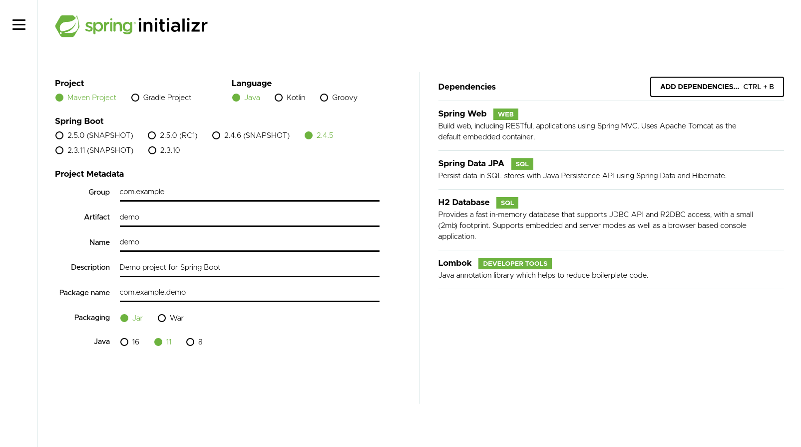

# Spring Starters

## https://start.spring.io

> This Document prepared for Beginner Level, so some ideas simplified for avoid confusion

* 

* `Spring Web` provides many packages what you need to build web application. Its focus http server
* `Spring Data JPA` Its focus RDMS on top of JPA and Hibernate 
* `H2 Database` In-memory database
* `Lombok` its a developer tool make code more readable 

All packages provide Abstract class like I mention `Database` in [Benefits of Framework](./1-Benefits-of-framework.md)

Spring gives production ready settings by default
